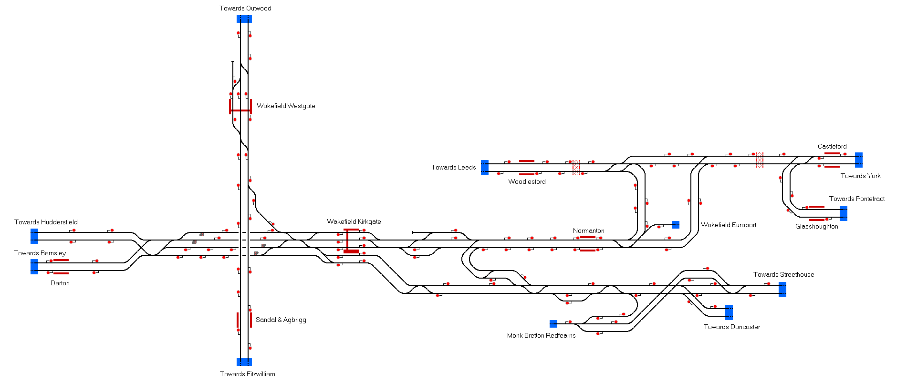

# Wakefield, West Yorkshire
This map represents the two stations around Wakefield, West Yorkshire, including several stations in the surrounding area.

## Current Status

| Stage         | Status        |
| ------------- |:-------------:|
| Track Plan     |  |
| Signalling      |       |
| Naming |       |
| Speed Limits |  |
| Distances |  |
| Timetable |  |
| Documentation |  |

### Note to developers

For the timetable, I am using David Humble's fantastic [TTbuilder](https://github.com/david-humble/TTbuilder) application which can generate a .ttb file from several XML files. Such files are stored in the Documentation folder. To use the program to generate a new timetable, move the files over to the test/samples folder inside TTbuilder. It may also be necessary to edit the .sh file to the correct path. Let me know if you need assistance with this. - Daniel Gill

## Data Sources

- [TRAKSY.UK](https://traksy.uk/live)
- Timetable Sources:
- [December 2019 Timetables - Table 026](https://sacuksprodnrdigital0001.blob.core.windows.net/electronic-national-rail-timetable/electronic%20National%20Rail%20Timetable/02.%20December%202019/London%20North%20East%20Route/Table%20026.pdf)
- [December 2019 Timetables - Table 031](https://sacuksprodnrdigital0001.blob.core.windows.net/electronic-national-rail-timetable/electronic%20National%20Rail%20Timetable/02.%20December%202019/London%20North%20East%20Route/Table%20031.pdf)
- [December 2019 Timetables - Table 032](https://sacuksprodnrdigital0001.blob.core.windows.net/electronic-national-rail-timetable/electronic%20National%20Rail%20Timetable/02.%20December%202019/London%20North%20East%20Route/Table%20032.pdf)
- [December 2019 Timetables - Table 034](https://sacuksprodnrdigital0001.blob.core.windows.net/electronic-national-rail-timetable/electronic%20National%20Rail%20Timetable/02.%20December%202019/London%20North%20East%20Route/Table%20034.pdf)

Status icons by Freepik, pixelmeetup, Pixel Perfect on FlatIcon.com.
